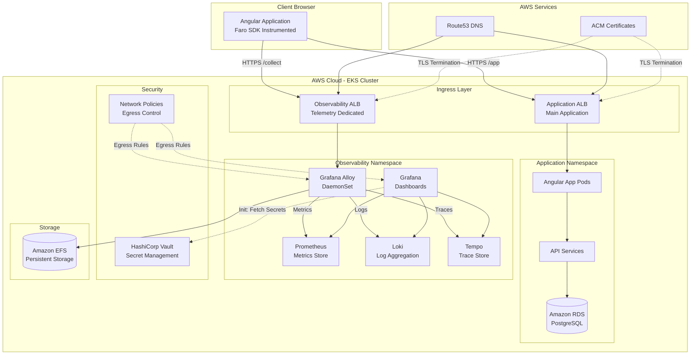
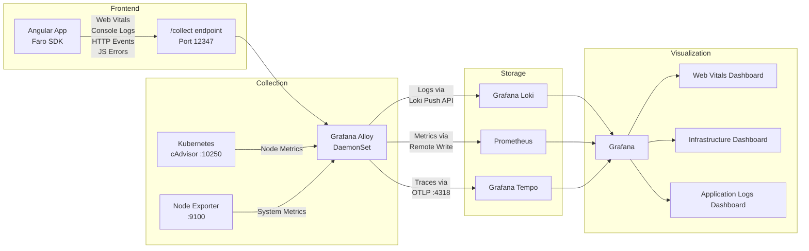
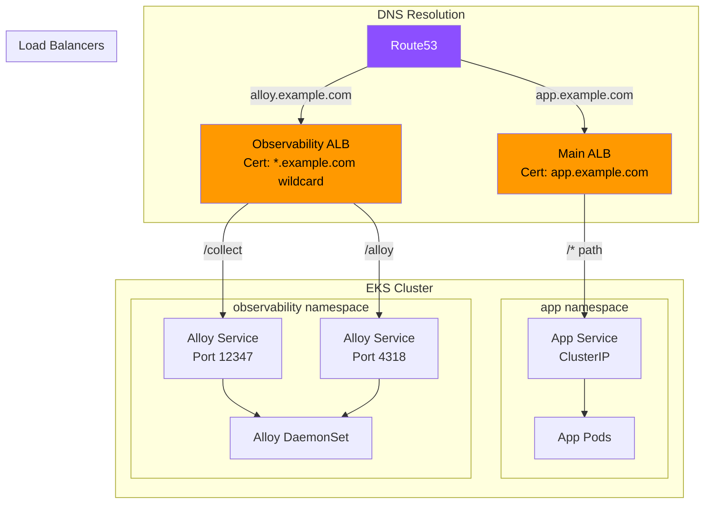
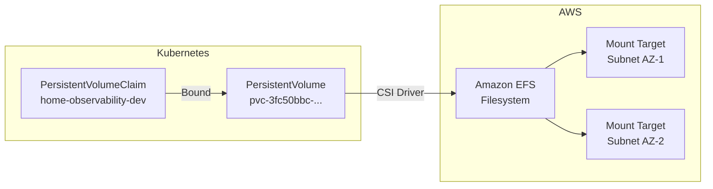
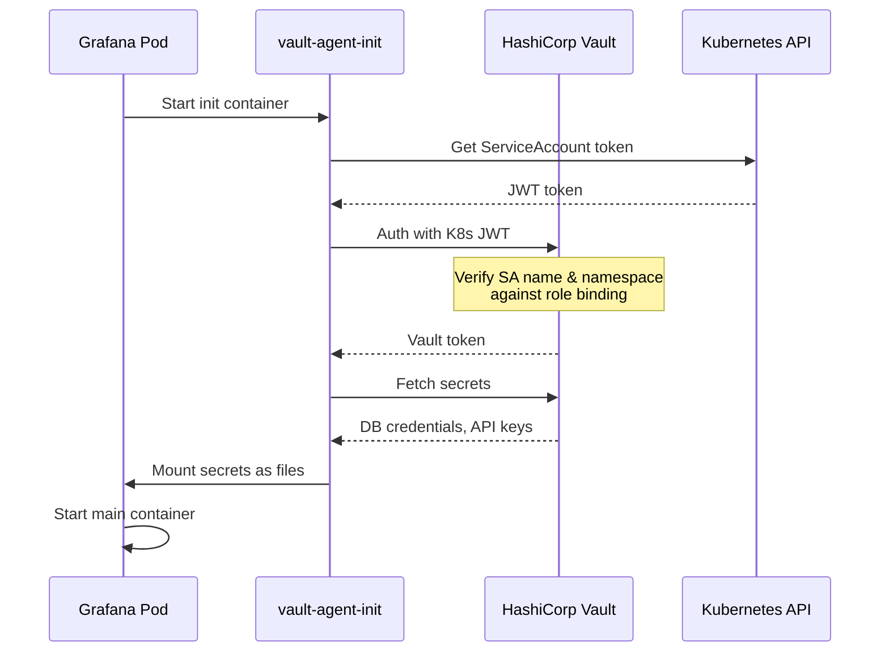
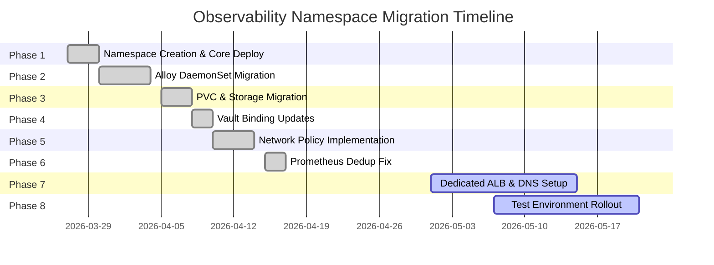
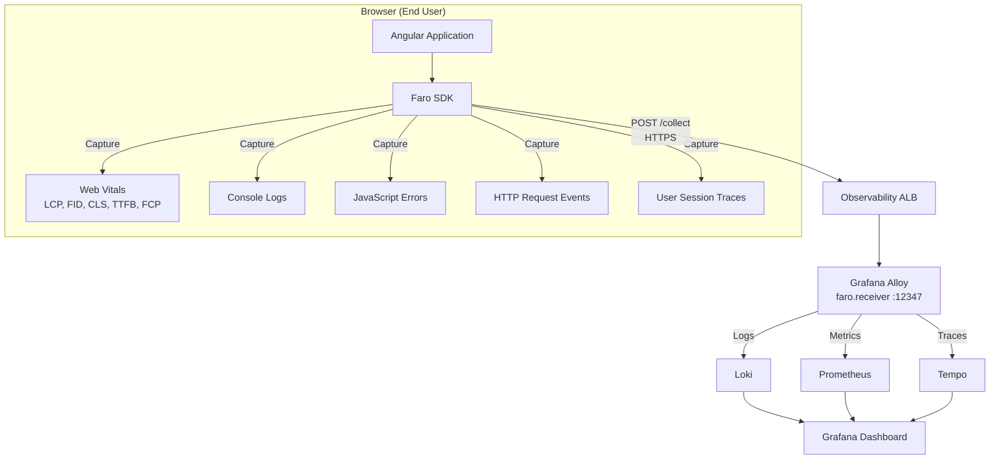
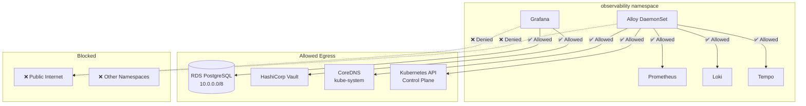
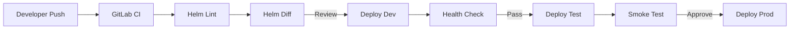

<p align="center">
  
</p>

<h1 align="center">🔭 Enterprise Observability Platform</h1>

<p align="center">
  <strong>Production-grade Kubernetes observability stack with full-stack telemetry, distributed tracing, and real-time monitoring</strong>
</p>

<p align="center">
  
  
  
  
  
</p>

<p align="center">
  
  
  
  
  
</p>

---

## 📋 Table of Contents

- [Overview](#-overview)
- [Architecture](#-architecture)
- [Tech Stack](#-tech-stack)
- [Project Structure](#-project-structure)
- [Infrastructure Components](#-infrastructure-components)
- [Deployment Guide](#-deployment-guide)
- [Namespace Migration](#-namespace-migration-strategy)
- [Frontend Telemetry (Faro SDK)](#-frontend-telemetry-faro-sdk)
- [Network Security](#-network-security)
- [CI/CD Pipeline](#-cicd-pipeline)
- [Monitoring & Dashboards](#-monitoring--dashboards)
- [Troubleshooting](#-troubleshooting)

---

## 🎯 Overview

A **production-grade, enterprise observability platform** deployed on AWS EKS (GovCloud) that provides unified monitoring, logging, tracing, and Real User Monitoring (RUM) for a mission-critical Angular application serving government operations.

### Key Achievements
- 🏗️ **Architected and executed a zero-downtime namespace migration** from a shared application namespace to a dedicated `observability` namespace
- 📊 **Implemented full-stack telemetry** — frontend (Faro SDK) → collector (Alloy) → storage (Loki/Prometheus/Tempo) → visualization (Grafana)
- 🔒 **Secured observability traffic** with dedicated ALB, wildcard SSL certificates, and Kubernetes NetworkPolicies
- 🔐 **Integrated HashiCorp Vault** for secrets management with namespace-aware Kubernetes auth
- 📈 **Built custom Grafana dashboards** for Web Vitals, application performance, and infrastructure health
- ⚡ **Migrated Alloy from StatefulSet to DaemonSet** for per-node telemetry collection and improved reliability

---

## 🏛️ Architecture

### High-Level System Architecture



### Data Flow Architecture



### Network Architecture



---

## 🛠️ Tech Stack

| Category | Technology | Purpose |
|----------|-----------|---------|
| **Container Orchestration** | Amazon EKS (Kubernetes 1.28+) | Managed Kubernetes on AWS GovCloud |
| **Telemetry Collector** | Grafana Alloy (DaemonSet) | Unified metrics, logs, and trace collection |
| **Metrics** | Prometheus | Time-series metrics storage and alerting |
| **Logging** | Grafana Loki | Horizontally-scalable log aggregation |
| **Tracing** | Grafana Tempo | Distributed tracing backend |
| **Dashboards** | Grafana 10.x | Unified visualization and alerting |
| **Frontend RUM** | Grafana Faro SDK | Real User Monitoring, Web Vitals, error tracking |
| **Secrets** | HashiCorp Vault | Dynamic secret management with K8s auth |
| **Ingress** | AWS ALB Ingress Controller | L7 load balancing with TLS termination |
| **Storage** | Amazon EFS | Shared persistent storage (ReadWriteMany) |
| **DNS** | Amazon Route53 | DNS management and health checking |
| **Certificates** | AWS ACM | SSL/TLS certificate management |
| **CI/CD** | GitLab CI | Automated deployment pipelines |
| **Package Manager** | Helm 3 | Kubernetes application management |
| **Network Security** | Kubernetes NetworkPolicies | Microsegmentation and egress control |
| **Frontend** | Angular 16+ | Enterprise SPA with Faro instrumentation |

---

## 📁 Project Structure

```
enterprise-observability-platform/
├── README.md
├── helm/
│   ├── alloy/
│   │   ├── values-dev.yaml          # Alloy DaemonSet config (dev)
│   │   ├── values-test.yaml         # Alloy DaemonSet config (test)
│   │   └── alloy-config.alloy       # Alloy pipeline configuration
│   ├── grafana/
│   │   └── values-dev.yaml          # Grafana deployment values
│   ├── prometheus/
│   │   └── values-dev.yaml          # Prometheus deployment values
│   ├── loki/
│   │   └── values-dev.yaml          # Loki deployment values
│   └── tempo/
│       └── values-dev.yaml          # Tempo deployment values
├── kubernetes/
│   ├── ingress/
│   │   ├── alloy-faro-ingress.yaml  # Dedicated ALB for Faro telemetry
│   │   └── grafana-ingress.yaml     # Grafana dashboard access
│   ├── storage/
│   │   ├── pvc-dev.yaml             # EFS PersistentVolumeClaim (dev)
│   │   └── pvc-test.yaml            # EFS PersistentVolumeClaim (test)
│   ├── network-policies/
│   │   ├── deny-external-egress.yaml
│   │   └── allow-internal-rds.yaml
│   ├── rbac/
│   │   ├── alloy-clusterrole.yaml
│   │   └── prometheus-clusterrole.yaml
│   └── vault/
│       └── vault-auth-config.yaml   # Vault K8s auth role bindings
├── faro-sdk/
│   ├── faro-init.ts                 # Faro SDK initialization
│   └── environment.config.ts        # Environment-specific endpoints
├── ci-cd/
│   └── .gitlab-ci.yml               # GitLab CI pipeline
├── dashboards/
│   └── web-vitals-dashboard.json    # Grafana Web Vitals dashboard
└── docs/
    ├── migration-guide.md           # Namespace migration documentation
    ├── troubleshooting.md           # Common issues and fixes
    └── images/
        └── banner.png
```

---

## 🧩 Infrastructure Components

### Grafana Alloy — Telemetry Collector

Deployed as a **DaemonSet** (one pod per node) for comprehensive telemetry collection:

```yaml
# Key service ports
ports:
  - name: alloy-ui       # Port 12345 — Debug UI dashboard
  - name: otlp-grpc      # Port 4317  — OpenTelemetry gRPC receiver
  - name: otlp-http      # Port 4318  — OpenTelemetry HTTP receiver
  - name: faro-receiver   # Port 12347 — Faro SDK /collect endpoint
  - name: metrics         # Port 9090  — Self-monitoring metrics
```

**Why DaemonSet over StatefulSet?**
- One collector per node ensures no blind spots
- Automatic scaling as nodes are added/removed
- Local kubelet metric scraping without cross-node traffic
- Simplified WAL management (no shared state)

### Persistent Storage Architecture



### HashiCorp Vault Integration



---

## 🚀 Deployment Guide

### Prerequisites

- AWS EKS cluster (1.28+) with AWS Load Balancer Controller
- Helm 3.x installed
- `kubectl` configured for target cluster
- HashiCorp Vault accessible from cluster
- AWS EFS CSI Driver installed
- AWS ACM certificate (wildcard recommended)

### Step 1: Create Namespace

```bash
kubectl create namespace observability
```

### Step 2: Create Persistent Storage

```bash
kubectl apply -f kubernetes/storage/pvc-dev.yaml
# Verify
kubectl get pvc -n observability
```

### Step 3: Deploy Observability Stack

```bash
# Deploy Prometheus
helm upgrade --install prometheus prometheus-community/prometheus \
  -n observability -f helm/prometheus/values-dev.yaml

# Deploy Loki
helm upgrade --install loki grafana/loki \
  -n observability -f helm/loki/values-dev.yaml

# Deploy Tempo
helm upgrade --install tempo grafana/tempo \
  -n observability -f helm/tempo/values-dev.yaml

# Deploy Grafana
helm upgrade --install grafana grafana/grafana \
  -n observability -f helm/grafana/values-dev.yaml

# Deploy Alloy
helm upgrade --install alloy grafana/alloy \
  -n observability -f helm/alloy/values-dev.yaml
```

### Step 4: Configure Ingress & DNS

```bash
# Create Alloy telemetry ingress
kubectl apply -f kubernetes/ingress/alloy-faro-ingress.yaml

# Get ALB hostname for Route53
kubectl get ingress alloy-faro-ingress -n observability \
  -o jsonpath='{.status.loadBalancer.ingress[0].hostname}'
```

### Step 5: Apply Network Policies

```bash
kubectl apply -f kubernetes/network-policies/
```

---

## 🔄 Namespace Migration Strategy

Successfully executed a **zero-downtime migration** of the entire observability stack from a shared application namespace to a dedicated namespace.

### Migration Phases



### Key Challenges Solved

| Challenge | Root Cause | Solution |
|-----------|-----------|----------|
| Grafana stuck in `Init:0/1` | Vault auth role bound to old namespace only | Updated Vault role: `bound_service_account_namespaces=app,observability` |
| Prometheus `out-of-order` errors | Duplicate cAdvisor scrapes from old + new Alloy | Removed duplicate scrape config, restarted DaemonSet to clear WAL |
| Faro SDK `503` on `/collect` | Old Alloy ingress deleted with Helm uninstall | Created dedicated ALB in observability namespace |
| ALB group.name caused outage | Merging ingress groups triggered ALB reconciliation | Abandoned group merge; deployed separate dedicated ALB |
| EFS mount failures in test | Missing mount targets + IAM role permissions | Created EFS mount targets in correct subnets, updated IRSA |
| Cross-namespace routing impossible | ALB ip-mode only routes to same-namespace services | Dedicated ALB per namespace (same pattern as Grafana) |

---

## 📱 Frontend Telemetry (Faro SDK)

### Integration Architecture



### SDK Initialization

```typescript
import { initializeFaro } from '@grafana/faro-web-sdk';
import { getWebInstrumentations } from '@grafana/faro-web-sdk';
import { TracingInstrumentation } from '@grafana/faro-web-tracing';

initializeFaro({
  url: environment.faroCollectorUrl,  // https://alloy.example.com/collect
  app: {
    name: 'enterprise-app',
    version: '1.0.0',
    environment: environment.name
  },
  instrumentations: [
    ...getWebInstrumentations({
      captureConsole: true,
      captureConsoleDisabledLevels: []
    }),
    new TracingInstrumentation()
  ]
});
```

---

## 🔒 Network Security

### Network Policy Strategy



---

## 🔄 CI/CD Pipeline

### Deployment Flow



---

## 📊 Monitoring & Dashboards

### Web Vitals Dashboard
Real-time frontend performance monitoring capturing Core Web Vitals:

| Metric | Description | Target |
|--------|-------------|--------|
| **LCP** | Largest Contentful Paint | < 2.5s |
| **FID** | First Input Delay | < 100ms |
| **CLS** | Cumulative Layout Shift | < 0.1 |
| **TTFB** | Time to First Byte | < 800ms |
| **FCP** | First Contentful Paint | < 1.8s |

### Infrastructure Monitoring
- Node-level metrics (CPU, memory, disk, network)
- Pod resource utilization and limits
- Kubernetes state metrics (deployments, replicas, PVCs)
- Alloy collector health and throughput

---

## 🔧 Troubleshooting

### Common Issues

<details>
<summary><b>Grafana stuck in Init:0/1</b></summary>

**Cause:** Vault auth role not updated for new namespace.

```bash
# Check init container logs
kubectl logs grafana-0 -n observability -c vault-agent-init

# Fix: Update Vault role
vault write auth/kubernetes/role/grafana \
  bound_service_account_names=grafana \
  bound_service_account_namespaces=app,observability \
  policies=grafana-policy \
  ttl=1h

# Restart
kubectl rollout restart statefulset grafana -n observability
```
</details>

<details>
<summary><b>Prometheus out-of-order sample errors</b></summary>

**Cause:** Duplicate scrape configs writing to same Prometheus instance.

```bash
# Restart Alloy to clear stale WAL
kubectl rollout restart daemonset alloy -n observability
kubectl rollout status daemonset alloy -n observability
```
</details>

<details>
<summary><b>Faro SDK returning 503 on /collect</b></summary>

**Cause:** Alloy ingress missing or misconfigured.

```bash
# Verify ingress exists
kubectl get ingress alloy-faro-ingress -n observability

# Verify ALB has address
kubectl get ingress alloy-faro-ingress -n observability \
  -o jsonpath='{.status.loadBalancer.ingress[0].hostname}'

# Verify Alloy service has endpoints
kubectl get endpoints alloy -n observability
```
</details>

<details>
<summary><b>EFS PVC mount failures</b></summary>

**Cause:** Missing EFS mount targets or IAM permissions.

```bash
# Check PVC status
kubectl get pvc -n observability

# Check pod events
kubectl describe pod <pod-name> -n observability | tail -20

# Verify EFS mount targets exist in VPC subnets
aws efs describe-mount-targets --file-system-id <fs-id>
```
</details>

---

## 📝 License

This project is licensed under the MIT License — see the [LICENSE](LICENSE) file for details.

---

<p align="center">
  <sub>Built with ❤️ for enterprise-grade observability</sub>
</p>
